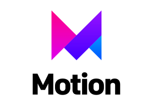
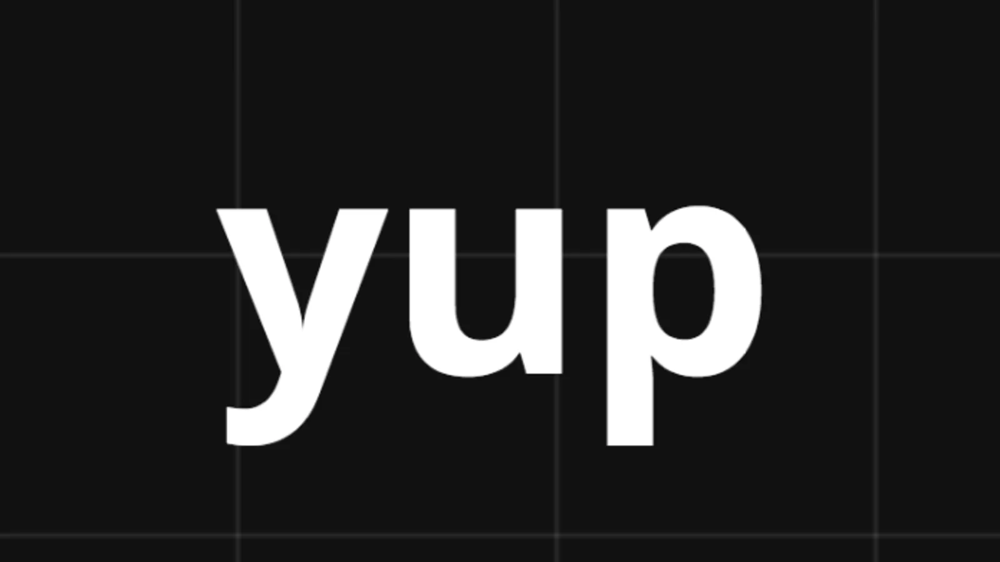

# Covid Questionaire

The Covid Questionnaire is an application that new employees need to fill in to find out what their position is on Covid and how Redberry can improve and support internal Covid policy


## Table of Contents

- [Prerequisites](#Prerequisites)
- [Resources](#resources)
- [Tech Stack](#tech-stack)
- [Getting Start](#getting-started)
- [Project Structure](#project-structure)

## Prerequisites

- <p>Node JS</p>
- <p>NPM </p>

## Resources

- <a href="https://redberry.gitbook.io/assignment-i-covid-questionaire/">Documentation</a>
- <a href="https://www.figma.com/file/56t2BI25FcD0LAIjR4GVkQ/%E1%83%99%E1%83%98%E1%83%97%E1%83%AE%E1%83%95%E1%83%90%E1%83%A0%E1%83%98?node-id=37%3A3">Application Design [Figma]</a>
- <a href="https://www.figma.com/proto/56t2BI25FcD0LAIjR4GVkQ/%E1%83%99%E1%83%98%E1%83%97%E1%83%AE%E1%83%95%E1%83%90%E1%83%A0%E1%83%98?node-id=37-3&starting-point-node-id=1%3A2&scaling=contain">Application Design Prototype</a>
- <a href="https://covid19.devtest.ge/api-specs">Api Specificiation</a>
- <a href="https://fonts.ge/ka/font/13/BPG-Arial">Font [BGP Arial]</a>

## Tech Stack

- <p><a href="https://react.dev/">React @18.2.0</a> - front-end framework</p>
- <p><a href="https://www.framer.com/motion/">Framer Motion @10.12.17</a> - Animation Library</p>
- <p><a href="https://react-hook-form.com/">React Hook Form @7.44.3</a> - Performant, flexible and extensible forms with easy-to-use validation.</p>
- <p><a href="https://github.com/jquense/yup">Yup @1.2.0</a> - schema builder for runtime value parsing and validation</p>
- <p><a href="https://reactrouter.com/en/main" >React Router @6.12.0</a> - Client Side Routing</p>

## Getting Started

1. First of all you need to clone Covid Questionaire repository from github:

```
    git clone https://github.com/RedberryInternship/anri-kopaliani-covid-quesitonare.git
```

2. Next step requires install all the dependencies

```
    npm install
```

or

```
    yarn install
```

3. put the url for the post request in .env file in VITE_API_URL

## Project Structure

```

├─── public
│ ├─── assets
├─── src
│ ├─── components
│ ├─── fonts
│ ├─── helpers
│ ├─── hooks
│ ├─── pages
│ ├─── schemas
│ ├─── store
│ ├─── App.jsx
│ ├─── index.css
│ ├─── main.jsx

- index.html
- .env
- package.json
- tailwind.config.js
- vite.config.js
```
